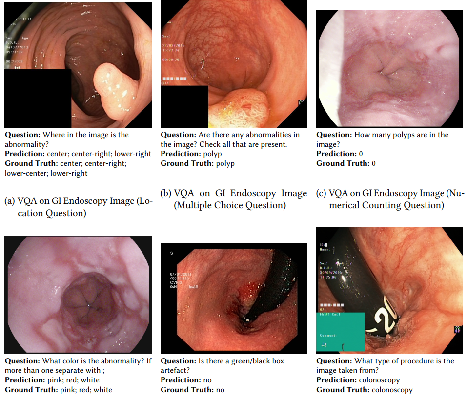

# ImageClef2025MedVQA_Task1
This repository documents my submission for the ImageClef2025MedVQA Task1

## Source Description

| File | Description |
| -- | -- |
| [*preprint_draft_49217.pdf*](preprint_draft_49217.pdf) | Preprint |
| [*src/florence2_hyperparameter.ipynb*](src/florence2_hyperparameter.ipynb) | Code for optimal hyperparameter search |
| [*src/florence2_64_ft.ipynb*](src/florence2_64_ft.ipynb) | Training code for florence2 with vision tower frozen |
| [*src/florence2_64_ft_ef.ipynb*](src/florence2_64_ft_ef.ipynb) | Training code for florence2 with vision tower and encoder frozen |
| [*src/florence2_64_r8.ipynb*](src/florence2_64_r8.ipynb) | Training code for florence2 with LoRa rank 8 |
| [*src/florence2_64_r16.ipynb*](src/florence2_64_r16.ipynb) | Training code for florence2 with LoRa rank 16 |

## Preview
